# 🛡️ MISP-Wazuh Integration

<div align="center">
  
[](https://www.misp-project.org/)
[](https://wazuh.com/)
[](https://learn.microsoft.com/en-us/sysinternals/downloads/sysmon)

</div>

## 📋 Table of Contents
- [Introduction](#introduction)
- [Prerequisites](#prerequisites)
- [Installation and Configuration](#installation-and-configuration)
  - [Installing MISP](#installing-misp)
  - [Initial MISP Configuration](#initial-misp-configuration)
  - [Installing Wazuh](#installing-wazuh)
  - [Initial Wazuh Configuration](#initial-wazuh-configuration)
  - [Wazuh-Sysmon Integration](#wazuh-sysmon-integration)
- [MISP-Wazuh Integration](#misp-wazuh-integration)
  - [Integration Steps](#integration-steps)
  - [Integration Testing](#integration-testing)
- [Sources](#sources)

## Introduction

This project provides a detailed guide and necessary scripts to integrate MISP (Malware Information Sharing Platform) with Wazuh, a security monitoring solution. By combining these tools, security teams can automatically check Sysmon events against MISP's threat intelligence database, enabling real-time detection of known threats and indicators of compromise (IoCs).

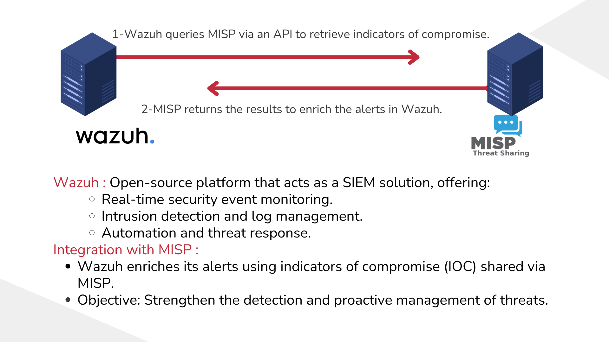

## Prerequisites

Before starting the integration, ensure you have the following:

- A machine with Ubuntu Server installed (for MISP and Wazuh installation)
- VMware or another virtualization platform (if using a VM)
- Docker installed (We’ll show how to install it if it’s not already installed)
- Basic knowledge of Linux command line, Docker, and network configuration
- Python 3 and `pip3` installed (for the integration script)

## Installation and Configuration

### Installing MISP

- MISP can be installed using three methods: automatic script, manual installation, or Docker. Choose the method that best suits your needs.
- In this guide, we will configure and run MISP using **Docker** For a faster and isolated deployment on an **Ubuntu Server** (virtual machine on VMware).

#### Installing Docker

<details>
<summary>Click to expand Docker installation steps</summary>

##### First, uninstall any old versions of Docker
```bash
for pkg in docker.io docker-doc docker-compose podman-docker containerd runc; do sudo apt-get remove $pkg; done
```

##### Add Docker's official GPG key
```bash
sudo apt-get update

sudo apt-get install ca-certificates curl gnupg

sudo install -m 0755 -d /etc/apt/keyrings

curl -fsSL https://download.docker.com/linux/ubuntu/gpg | sudo gpg --dearmor -o /etc/apt/keyrings/docker.gpg

sudo chmod a+r /etc/apt/keyrings/docker.gpg
```

##### Add the Docker repository
```bash
echo \
  "deb [arch="$(dpkg --print-architecture)" signed-by=/etc/apt/keyrings/docker.gpg] https://download.docker.com/linux/ubuntu \
  "$(. /etc/os-release && echo "$VERSION_CODENAME")" stable" | \
  sudo tee /etc/apt/sources.list.d/docker.list > /dev/null
```
```bash
sudo apt-get update
```

##### Install the Docker packages
```bash
sudo apt-get install docker-ce docker-ce-cli containerd.io docker-buildx-plugin docker-compose-plugin
```

##### Finally, verify Docker was installed successfully by executing
```bash
sudo docker run hello-world
```
</details>

#### Installing the MISP Docker Image

<details>
<summary>Click to expand MISP Docker installation steps</summary>

##### Clone the MISP Docker repository
```bash
git clone https://github.com/MISP/misp-docker
```

##### Configure files
```bash
cd misp-docker
cp template.env .env
vim .env
```

Modify the `MISP_BASEURL` variable in `.env` to reflect the machine's IP address.

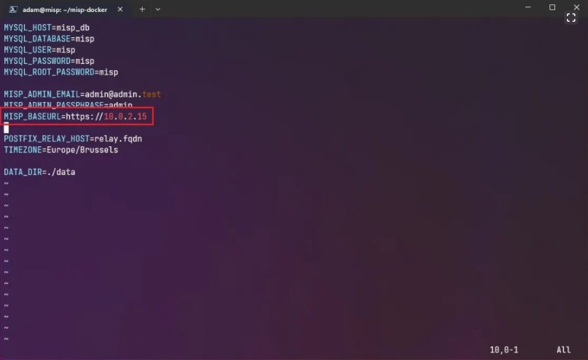

##### Next, build the Docker containers
```bash
sudo docker compose build
```
</details>

#### Running MISP Using Docker

<details>
<summary>Click to expand MISP Docker running steps</summary>

##### Edit the docker-compose.yml file
This file holds the configuration settings for the Docker environment running MISP. In particular, you need to update the `MISP_BASEURL` variable to match the IP address of the machine hosting MISP.

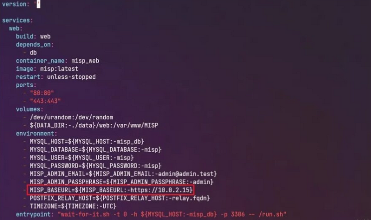

##### Launch MISP containers
```bash
sudo docker compose up
```

##### To stop the Docker environment
```bash
sudo docker compose down
```
</details>

### Initial MISP Configuration

#### Logging into MISP

You can access your MISP instance through ports 80 and 443 on the machine hosting MISP. Accept the security certificate, then log in as the default Administrator using the credentials:
- Username: `admin@admin.test`
- Password: `admin`

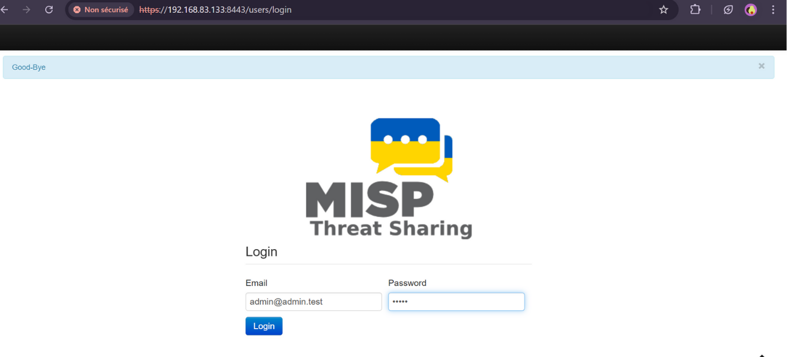

#### Adding feeds

<details>
<summary>Click to expand feed configuration steps</summary>

A MISP feed is a structured data source that automatically provides up-to-date information on cyber threats.

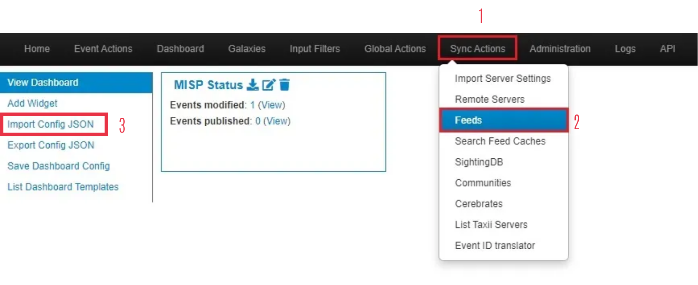

Paste this [script](https://github.com/MISP/MISP/blob/2.4/app/files/feed-metadata/defaults.json) here:

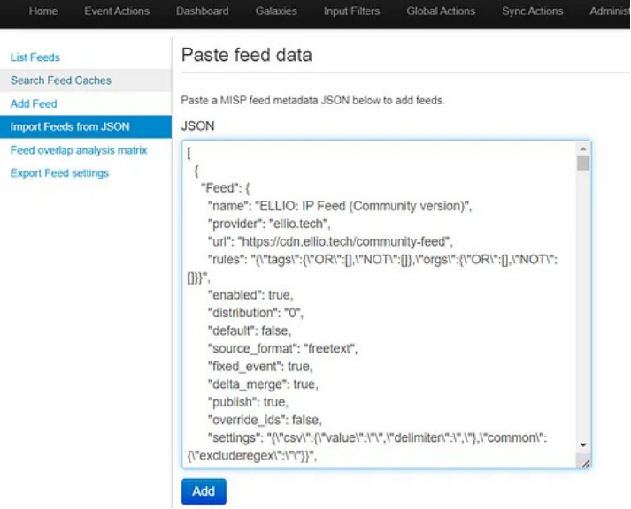

> ⚠️ **IMPORTANT**: DON'T FORGET TO ACTIVATE AND COLLECT THE FEEDS

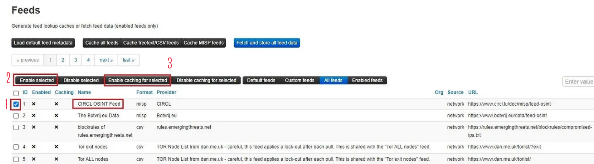
</details>

#### Generate an API key

<details>
<summary>Click to expand API key generation steps</summary>

- Click on administration >> list auth keys >>  Add authentication key

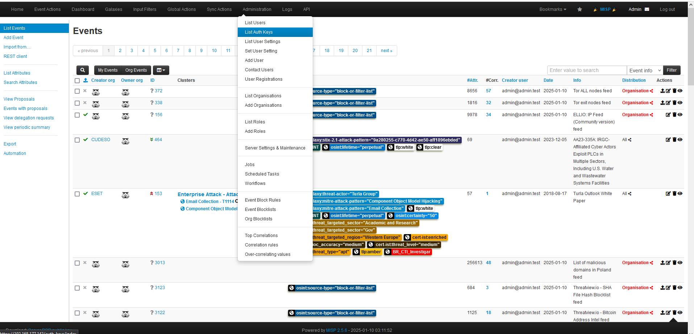
- We generate an authentication key to allow the API to recognize and authorize the user. Fields such as user, comment, and authorized IPs must be configured as needed before submitting.

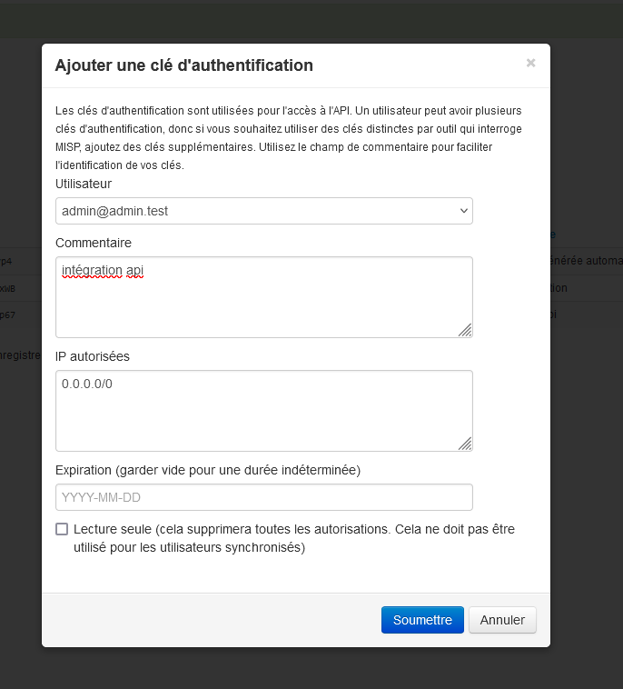
- Please make sure to write down the authentication key

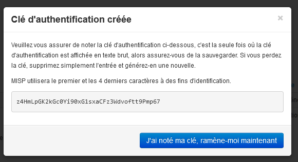
</details>

#### Set up a Cronjob to update feeds daily

```bash
0 1 * * * /usr/bin/curl -XPOST --insecure --header "Authorization: **YOUR_API_KEY**" --header "Accept: application/json" - header "Content-Type: application/json" https://**YOUR_MISP_ADDRESS**/feeds/fetchFromAllFeeds
```

### Installing Wazuh

- Wazuh offers an installation method called `Quick Start`
- Download and run the Wazuh installation assistant
```bash
curl -sO https://packages.wazuh.com/4.11/wazuh-install.sh && sudo bash ./wazuh-install.sh -a
```
- Once the installation is complete, the assistant will give us a username and password to connect to the indexer

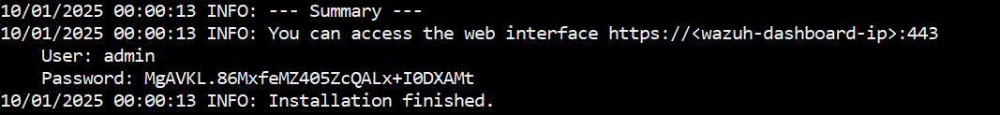

### Initial Wazuh Configuration

- We identify ourselves using the credentials given previously

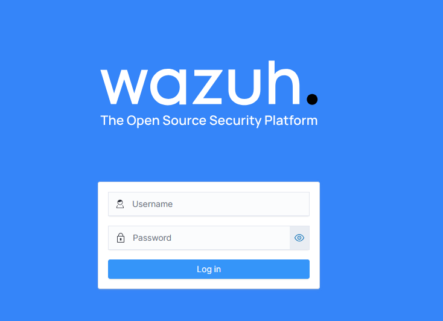
- Home page:

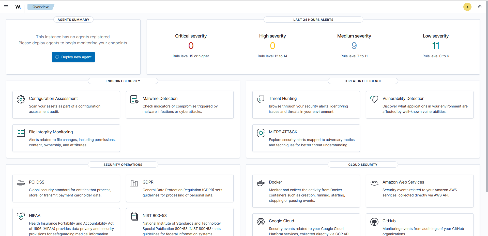

#### Adding agents

<details>
<summary>Click to expand agent deployment steps</summary>

- Click on `Deploy new agent`
- Select your agent's system

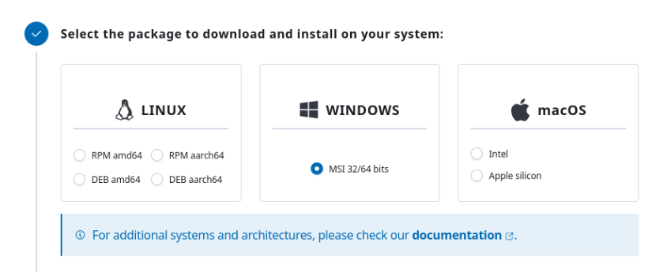
- Enter the server IP address. Then, name your agent, and add it to an existing group

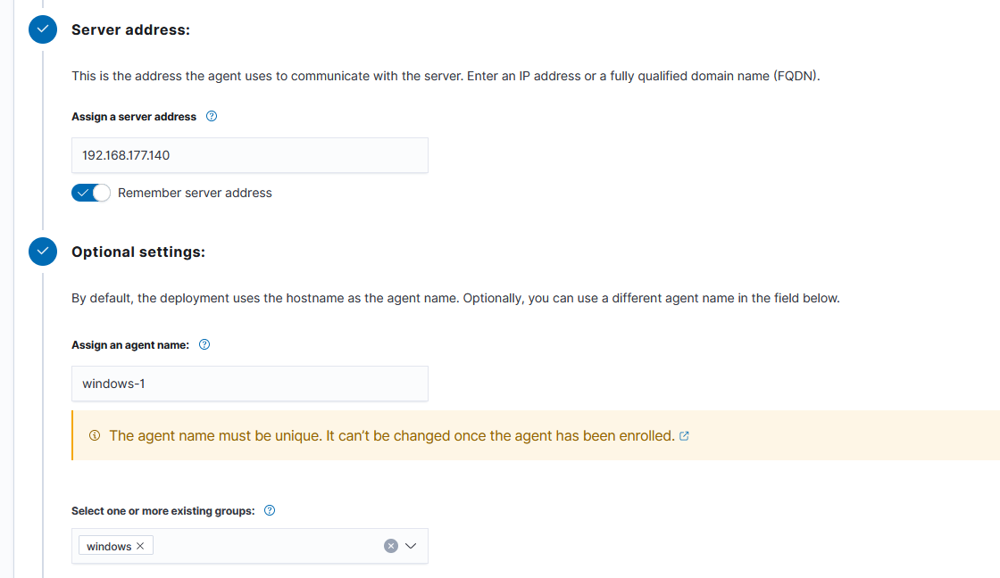
- Open PowerShell as an administrator and run the displayed installation command to download the agent. Then, start the agent using the `NET START WazuhSvc` command

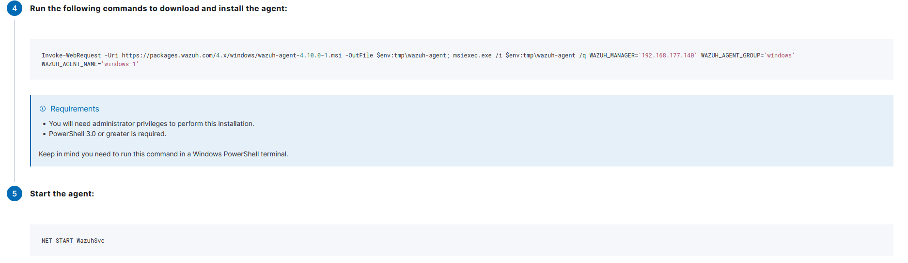
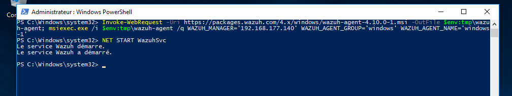
- This will create a directory under `C:\Program Files (x86)\ossec-agent`, which we can use later to manage the events sent to the wazuh manager

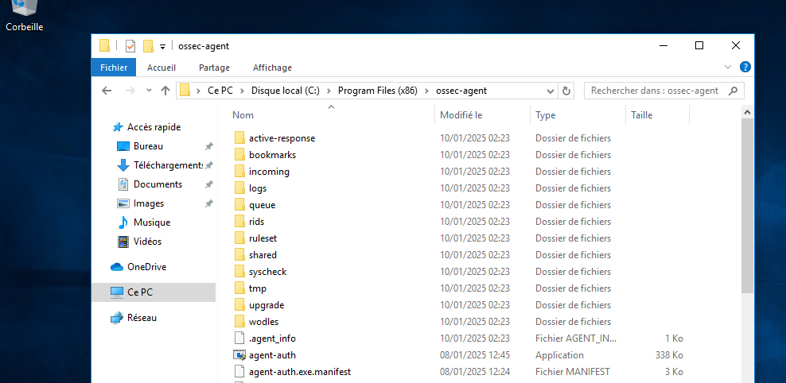
- And there you have it! The agent is deployed.

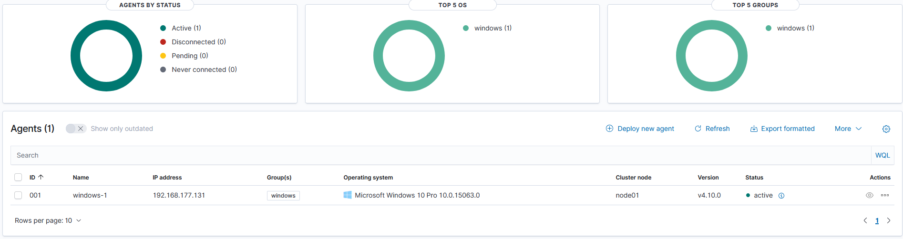
</details>

#### Wazuh-Sysmon Integration

##### Step 1: Installing and Configuring Sysmon

<details>
<summary>Click to expand Sysmon installation steps</summary>

- Download Sysmon from the Microsoft Sysinternals [page](https://learn.microsoft.com/en-us/sysinternals/downloads/sysmon).
- Download the Sysmon configuration file from this [link](https://github.com/SwiftOnSecurity/sysmon-config/blob/master/sysmonconfig-export.xml).
- Extract the Sysmon zip file and place the downloaded configuration file in the extracted folder.
- Install Sysmon with the configuration file using PowerShell (as administrator):
```powershell
.\sysmon64.exe -accepteula -i .\sysmonconfig-export.xml
```
</details>

##### Step 2: Configure the Wazuh agent

<details>
<summary>Click to expand Wazuh agent configuration steps</summary>

- Edit the Wazuh agent's `ossec.conf` file:
`C:\Program Files (x86)\ossec-agent\ossec.conf`
- Add the following configuration to collect Sysmon logs:
```xml
<localfile>
  <location>Microsoft-Windows-Sysmon/Operational</location>
  <log_format>eventchannel</log_format>
</localfile>
```
- Restart the Wazuh agent with the command:
```powershell
Restart-Service -Name wazuh
```
</details>

##### Step 3: Configure the Wazuh server

<details>
<summary>Click to expand Wazuh server configuration steps</summary>

- Add the following rules to the file `/var/ossec/etc/rules/local_rules.xml`:
```xml
<group name="win-sysmon">
  <rule id="100502" level="2">
    <if_sid>921101</if_sid>
    <field name="win.system.eventID" type="pcre2">^3$</field>
    <field name="win.eventdata.image" type="pcre2">^C:\\\\Windows\\\\System32\\\\WindowsPowerShell\\\\v1.0\\\\powershell.exe$</field>
    <description>Network connection initiated by PowerShell</description>
    <mitre>
      <id>T1059.001</id>
    </mitre>
  </rule>

  <rule id="100503" level="13" frequency="5" timeframe="60">
    <if_matched_sid>100502</if_matched_sid>
    <description>Multiple network connections initiated by PowerShell to "$(win.eventdata.destinationIp)" on port "$(win.eventdata.destinationPort)"</description>
    <mitre>
      <id>T1059.001</id>
    </mitre>
  </rule>
</group>
```
- Restart the Wazuh manager:
```bash
systemctl restart wazuh-manager
```
</details>

## MISP-Wazuh Integration

### Integration Steps

#### Step 1: Add the Python script

<details>
<summary>Click to expand integration script configuration steps</summary>

- Place [this Python script](https://github.com/karelumair/MISP-Wazuh-Integration/blob/main/custom-misp.py) at `/var/ossec/integrations/custom-misp`

> **Note:** Ensure that you didn't add extension `.py`

- Change the `URL` and the `API key` in the script.

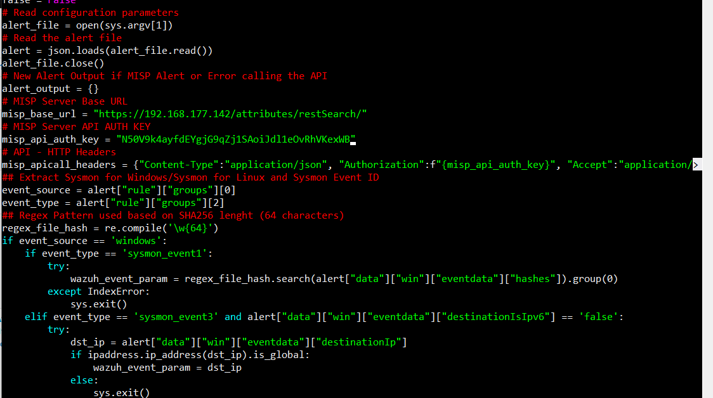

- Make sure to set the permissions:
```bash
cd /var/ossec/integrations/
sudo chown root:wazuh custom-misp && sudo chmod 750 custom-misp
```

- Make sure wazuh is already alerting for the desired sysmon events. You will likely need to create a custom rule if it isn't already alerting.
- For example, in our test we will need DNS queries from sysmon event 22
- We will change the under rule level from `0` to `4` in the file `/var/ossec/ruleset/rules/0595-win-sysmon_rules.xml`
```xml
<rule id="61650" level="4">
   <if_sid>61600</if_sid>
   <field name="win.system.eventID">^22$</field>
   <description>Sysmon - Event 22: DNS Query event</description>
   <options>no_full_log</options>
   <group>sysmon_event_22,</group>
 </rule>
```

> **Note:** We found the rule for event `22` in `0595-win-sysmon_rules.xml` because it falls between `05`-`95`. Follow the same approach to find the desired event.

> **Note:** There are 16 levels of rules `0`-`15`. Check [this page](https://documentation.wazuh.com/current/user-manual/ruleset/rules/rules-classification.html) to recognize each one.
</details>

#### Step 2: Configure the integration in Wazuh

<details>
<summary>Click to expand Wazuh integration configuration steps</summary>

- Edit the Wazuh manager's `/var/ossec/etc/ossec.conf` file to add the integration block:
```xml
<integration>
  <name>custom-misp</name>
  <group>sysmon_event1,sysmon_event3,sysmon_event6,sysmon_event7,sysmon_event_15,sysmon_event_22,syscheck</group>
  <alert_format>json</alert_format>
</integration>
```
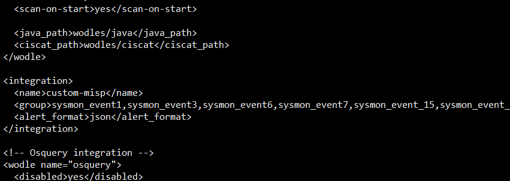


> **Note:** The manager will only run the script when one of the Sysmon groups is triggered

- Restart the Wazuh manager.
```bash
systemctl restart wazuh-manager
```
</details>

#### Step 3: Also add the following rule to the wazuh manager

<details>
<summary>Click to expand rule addition steps</summary>

- Go to `Server Management` > `Rules` > `Add New Rule file`. Name it `misp.xml`, add the following and save.
```xml
<group name="misp,">
  <rule id="100620" level="10">
    <field name="integration">misp</field>
    <match>misp</match>
    <description>MISP Events</description>
    <options>no_full_log</options>
  </rule>
  <rule id="100621" level="5">
    <if_sid>100620</if_sid>
    <field name="misp.error">\.+</field>
    <description>MISP - Error connecting to API</description>
    <options>no_full_log</options>
    <group>misp_error,</group>
  </rule>
  <rule id="100622" level="12">
    <field name="misp.category">\.+</field>
    <description>MISP - IoC found in Threat Intel - Category: $(misp.category), Attribute: $(misp.value)</description>
    <options>no_full_log</options>
    <group>misp_alert,</group>
  </rule>
</group>
```

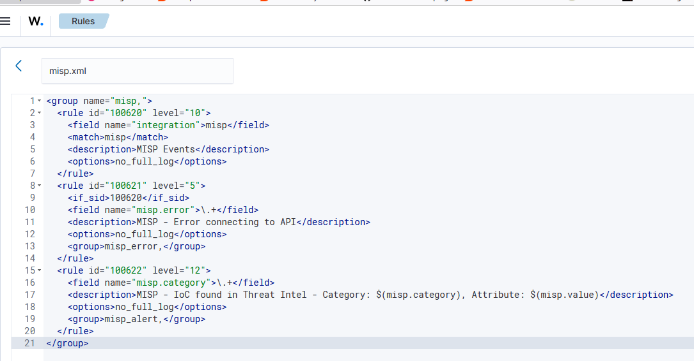
</details>

#### Step 4: Restart Wazuh services

```bash
systemctl restart wazuh-manager
systemctl restart wazuh-indexer
systemctl restart wazuh-dashboard
```

## Integration Testing

In the integration test, you can use any attribute from the feeds. However, we'll create our own event and add a domain attribute to it, allowing us to test with that domain later.

### Create our own event

<details>
<summary>Click to expand event creation steps</summary>

- Access the MISP interface via its URL (e.g.: http://<MISP_IP_address>).
- Create a new event with a title, distribution, and threat level, then submit.
- Add a domain attribute with a fictitious name, like `lolo.koko.co`, and save it.
- Publish the event by clicking on `Publish Event`

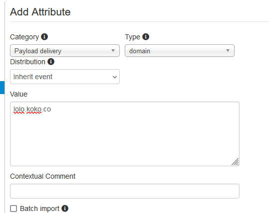

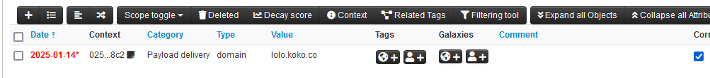

- On a Windows machine with the Wazuh agent installed, use PowerShell to interact with the added domain:

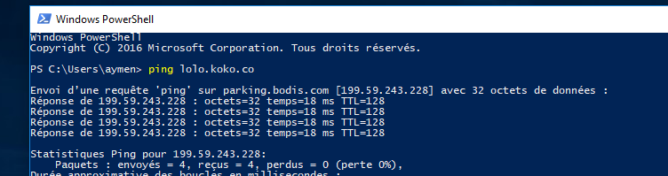

- Check if the malicious domain is detected and marked as a critical alert in the Sysmon logs transmitted to Wazuh.

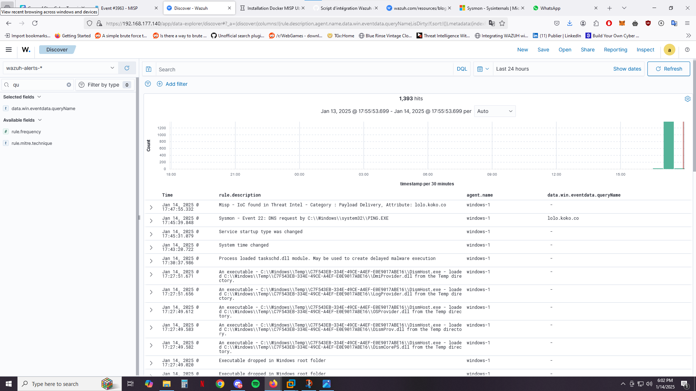

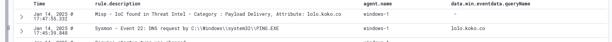
</details>

## Sources

<details>
<summary>Click to expand source references</summary>

- [MISP Project Documentation](https://www.misp-project.org/documentation/)
- [Wazuh Documentation](https://documentation.wazuh.com/)
- [Microsoft Sysmon Documentation](https://learn.microsoft.com/en-us/sysinternals/downloads/sysmon)
- [ MISP integration issues](https://www.reddit.com/r/Wazuh/comments/10hdd22/misp_integration_issues/)
- [wazuh sysmon logs forwarding issues](https://groups.google.com/g/wazuh/c/2FXD6wx0TDU)
- [youtube video](https://www.youtube.com/watch?v=-qRMDxZpnWg&t=1004s&ab_channel=TaylorWalton)
- [Additional guide](https://kravensecurity.com/threat-intelligence-with-misp-part-2-setting-up-misp/)

</details>

---

<div align="center">
  
## 🔄 Workflow Diagram

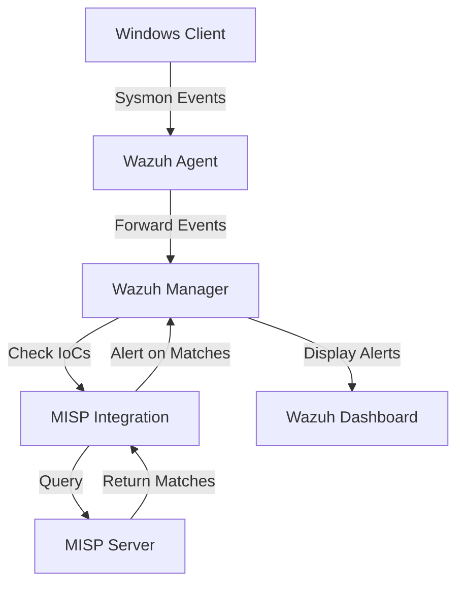
```mermaid
graph TD
    A[Windows Client] -->|Sysmon Events| B[Wazuh Agent]
    B -->|Forward Events| C[Wazuh Manager]
    C -->|Check IoCs| D[MISP Integration]
    D -->|Query| E[MISP Server]
    E -->|Return Matches| D
    D -->|Alert on Matches| C
    C -->|Display Alerts| F[Wazuh Dashboard]
```

</div>
